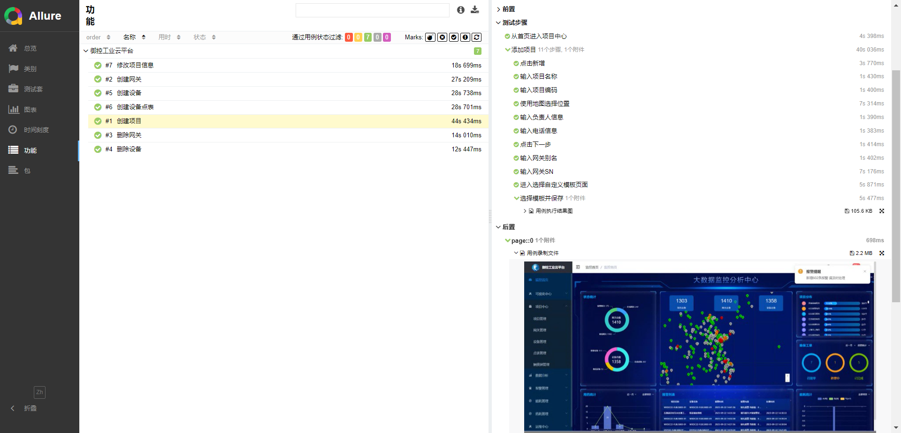

# *GitLab-UI*

## *御控工业云平台*

### 项目说明

|     目录      |      文件      |      说明      |  备注  | 
|:-----------:|:------------:|:------------:|:----:|
|    Auto     | cookies.json | 存储登录cookies  |  无   |
| Case_video  |              |  存储测试用例录屏文件  |  无   |
|   Common    |    tools     |   封装基本使用方法   |  无   |
|    Logs     |              |    存储执行日志    |  无   |
|    Page     |  **_page.py  |    封装页面元素    | PO模式 |
|   Reports   |      无       | 存储Allure测试报告 |  无   |
|    Temps    |      无       |   存储测试报告数据   |  无   |
|  TestCases  |  test_xx.py  |  存储最大化测试用例   |  无   |
| Conftest.py | conftest.py  |  封装浏览器驱动和登录  |  无   |
|   Main.Py   |    总执行文件     |  Pytest执行文件  |  无   |
| Pytest.ini  |  Pytest.ini  |    测试框架配置    |  无   |

### 示例

> #### 定位单个元素用法: self.input_data((定位方式,元素路径), "功能说明", 要输入的参数信息)
>#### 定位列表元素用法  self.input_data((定位方式,元素路径,元素下标), "功能说明", 要输入的参数信息)
>#### 初始化步骤: 首先调用相应端的初始化方法
>#### 如: 变量名称(web) = WebStart.start('浏览器名称')
>#### 调用封装的元素Page页面方法
>#### login = Login(传入初始化变量-web)

#### *环境配置*

> `pip install playwright`   #安装定位元素库#
>
> `python -m playwright install`  #安装浏览器驱动#
>
> `playwright codegen http://36.134.46.91:7070/ ` 启动脚本录制
>
> `page.page.pause()`   启动调试功能
> `playwright show-trace trace.zip`  查看跟踪日志 或者打开 https://trace.playwright.dev/ 去传入文件 trace.zip

#### *Allure测试报告*

#### 问题

##### 提交Git不上时，请使用

> `git config --global --unset http.proxy`
>
> `git config --global --unset https.proxy`

#### 获取用例执行顺序-终端执行
> `pytest --collect-only    `

 